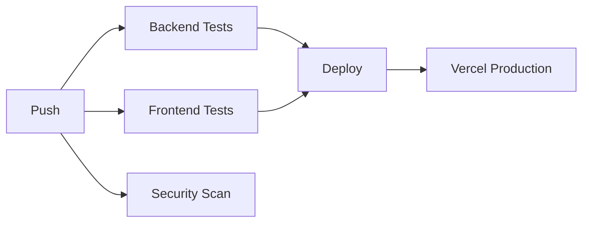
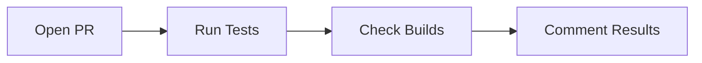

# 🚀 CI/CD Pipeline - Clínica Odontológica

## Visão Geral

Este projeto utiliza **GitHub Actions** para implementar um pipeline completo de CI/CD (Integração Contínua e Entrega Contínua).

## Workflows Implementados

### 1. CI/CD Pipeline Principal (`ci-cd.yml`)

Executa em:

- Push para branches `main` ou `develop`
- Pull requests para `main` ou `develop`

#### Jobs:

##### 🧪 Backend Tests

- Executa testes em Node.js 18.x e 20.x
- Instala dependências
- Gera Prisma Client
- Executa testes automatizados
- Gera relatório de cobertura
- Envia cobertura para Codecov

##### 🎨 Frontend Tests

- Executa testes em Node.js 18.x e 20.x
- Instala dependências
- Executa testes automatizados
- Faz build do projeto
- Gera relatório de cobertura
- Envia cobertura para Codecov

##### 🚢 Deploy

- Executa apenas após sucesso dos testes
- Deploy automático para Vercel em push para `main`
- Deploy separado de backend e frontend

##### 🔒 Security Scan

- Executa `npm audit` em ambos os projetos
- Verifica vulnerabilidades conhecidas
- Continua mesmo com avisos (não bloqueia)

### 2. Pull Request Checks (`pr-checks.yml`)

Executa em:

- Abertura de PR
- Atualização de PR
- Reabertura de PR

#### Funcionalidades:

- ✅ Executa todos os testes
- 🏗️ Verifica se os builds funcionam
- 💬 Comenta no PR com resultados
- ⚡ Feedback rápido para revisores

### 3. Dependency Updates (`dependency-check.yml`)

Executa:

- Automaticamente toda segunda-feira às 9h
- Manualmente via workflow dispatch

#### Funcionalidades:

- 📦 Verifica dependências desatualizadas
- 🔐 Executa auditoria de segurança
- 📊 Gera relatório no Summary

## Configuração Inicial

### 1. Secrets do GitHub

Configure os seguintes secrets no repositório GitHub:
(`Settings` → `Secrets and variables` → `Actions` → `New repository secret`)

```
VERCEL_TOKEN              # Token de API da Vercel
VERCEL_ORG_ID            # ID da organização Vercel
VERCEL_PROJECT_ID_BACKEND # ID do projeto backend na Vercel
VERCEL_PROJECT_ID_FRONTEND # ID do projeto frontend na Vercel
```

### 2. Obter Credenciais Vercel

```bash
# Instalar Vercel CLI
npm install -g vercel

# Login
vercel login

# No diretório do backend
cd backend
vercel link

# No diretório do frontend
cd ../frontend
vercel link
```

Os IDs estarão em `.vercel/project.json`

### 3. Codecov (Opcional)

Para relatórios de cobertura de código:

1. Acesse [codecov.io](https://codecov.io)
2. Conecte seu repositório
3. Adicione o token (se privado):
   ```
   CODECOV_TOKEN  # Token do Codecov
   ```

## Estrutura dos Workflows

```
.github/
└── workflows/
    ├── ci-cd.yml              # Pipeline principal
    ├── pr-checks.yml          # Checks de PR
    └── dependency-check.yml   # Atualização de dependências
```

## Como Funciona

### 1. Push para Main/Develop



### 2. Pull Request



## Badges para README

Adicione badges ao README.md:

```markdown


[](https://codecov.io/gh/seu-usuario/clinica-gygy)
```

## Monitoramento

### Visualizar Execuções

1. Acesse o repositório no GitHub
2. Vá para a aba **Actions**
3. Veja o histórico de execuções
4. Clique em uma execução para ver detalhes

### Notificações

Configure notificações:

- `Settings` → `Notifications`
- Habilite notificações para falhas de workflow

## Otimizações

### Cache de Dependências

O pipeline usa cache do npm para acelerar instalações:

```yaml
- uses: actions/setup-node@v4
  with:
    cache: "npm"
    cache-dependency-path: backend/package-lock.json
```

### Matriz de Testes

Testes executam em paralelo para Node.js 18.x e 20.x, garantindo compatibilidade.

### Execução Condicional

Deploy só executa:

- Se todos os testes passarem
- Em push para `main`
- Não em pull requests

## Troubleshooting

### ❌ Testes Falhando no CI mas Passando Localmente

**Causas comuns:**

- Diferenças de ambiente
- Dependências não commitadas
- Variáveis de ambiente faltando

**Solução:**

```bash
# Limpar e reinstalar
rm -rf node_modules package-lock.json
npm install
npm test
```

### ❌ Deploy Falhando

**Verifique:**

1. Secrets configurados corretamente
2. Projetos linkados na Vercel
3. Builds locais funcionando

**Debug:**

```bash
# Testar build localmente
cd backend && npm start
cd frontend && npm run build
```

### ❌ Workflow Não Executa

**Verifique:**

1. Branch está correta (`main`, `develop`)
2. Arquivo YAML tem sintaxe válida
3. Permissões do GitHub Actions habilitadas

## Custos

### GitHub Actions

- Repositórios públicos: **Gratuito ilimitado**
- Repositórios privados: 2000 minutos/mês grátis

### Vercel

- Hobby: **Gratuito**
- Pro: $20/mês (se necessário)

## Melhorias Futuras

- [ ] Testes E2E com Playwright
- [ ] Deploy para staging antes de produção
- [ ] Análise de performance (Lighthouse CI)
- [ ] Testes de carga com K6
- [ ] Notificações no Slack/Discord
- [ ] Rollback automático em falhas
- [ ] Feature flags com LaunchDarkly

## Recursos

- [GitHub Actions Docs](https://docs.github.com/actions)
- [Vercel Deployment](https://vercel.com/docs/concepts/deployments)
- [Codecov Documentation](https://docs.codecov.com/)
- [Jest CI Configuration](https://jestjs.io/docs/continuous-integration)

## Suporte

Para problemas com o pipeline:

1. Verifique os logs na aba Actions
2. Consulte este guia
3. Abra uma issue no repositório
